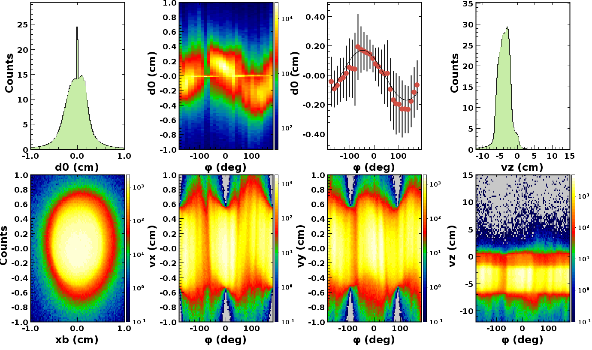
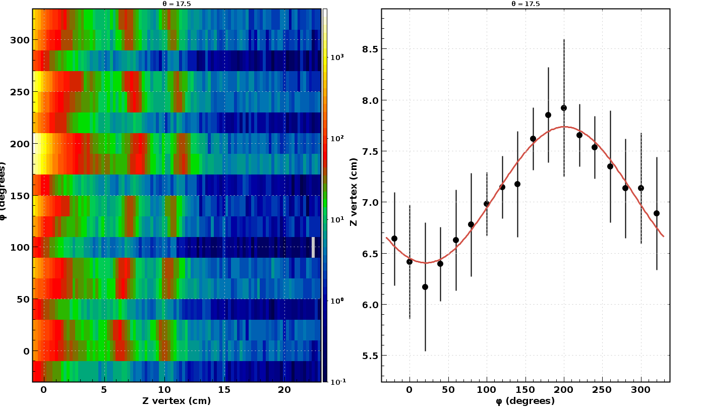
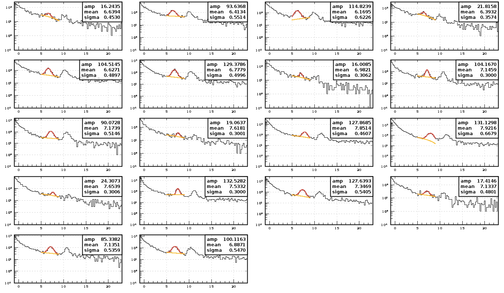
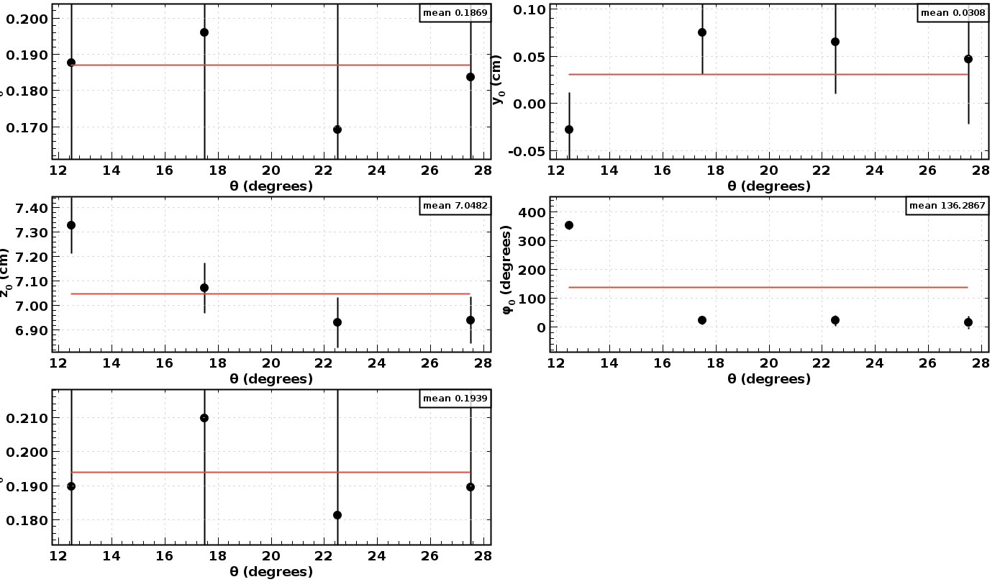

# Beam Position

This code was built merging two beam spot codes from the CVT (CD) and DC :
- CVTMonitoring, author Raffaella De Vita (github link ?)
- DC Beamspot, author Francesco Bossù (github link ?)

## General

To run the code, clone the repository and build the maven application with:
```
mvn clean install
```

The code can then be run with :
```
./bin/BeamSpot.sh [OPTIONS] FILE1 FILE2 ...
```
To run the in slurm jobs  `BeamSpot.sh` needs to be modified setting `SCRIPT_DIR` to the absolute path.

#### Options

General options
- -CD : set to 0 to deactivate CD beam spot analysis (default = 1)
- -DC : set to 0 to deactivate DC beam spot analysis (default = 1)
- -X : do NOT save histograms in a hipo file (default = 0)
- -o : histogram file name prefix (default = )
- -n : maximum number of events to process (default = -1)
- -plot : display histograms (0/1) (default = 1)
- -print : print canvases (0/1) (requires -plot activated) (default = 0)
- -stats : histogram stat option (e.g. "10" will display entries) (default = )
- -histo : read histogram from hipo file (0/1) (default = 0)

Analysis options
- -x0 : x position of the beam used in the reconstruction (average raster position if raster is used) (default = 0)
- -y0 : y position of the beam used in reconstruction (average raster position if raster is used) (default = 0)
- -Nphi : phi bins per sector in the DC analysis (default = 10)
- -Zvertex : nominal Z position of the target window fitted in the DC analysis (default = 25.4)
- -zmax : upper bound of the foil fit window in z (default = Zvertex + 6)
- -zmin : lower bound of the foil fit window in z (default = Zvertex - 6.)

#### Outputs

If the code is run with data files, the code will output one `PREFIX_histo.hipo` file containing histograms with all the relevant data from all the input files (unless the -X option is activated).

Once histogram files are created they can be analysed again and plotted with the `-histo` option. The analysis is then rerun merging all the files given in input. The analysis options `-Zvertex -zmax -zmin` can be modified with respect to the options used when creating the `PREFIX_histo.hipo` files but the `-x0 -y0 -Nphi` options need to remain the same.

In both cases the absolute beam position and the average nominal reconstruction beam position are written into two files:
- CD:  `PREFIX+"_CD_ccdb_table.txt`
- DC:  `PREFIX+"_DC_ccdb_table.txt`

#### Beam spot used in reconstruction 

By default the code assumes that the beam position used in the reconstruction is 0 but is it possible to set it with the `-x0 -y0` options. When a raster is used the average raster position can be set with the same options but additionally the RASTER::position bank is needed in the data files to have the nominal beam position track by track.


## CD beam spot analysis

The CD beam spot analysis is run separately on positive and negative, REC::Track and  REC::UTrack. The reference beam spot is extracted from negative UTracks. Unconstrained tracks are used to remove the bias induced by using the beam spot information in the track reconstruction. Negative tracks are preferred since they typically provide a better accuracy because of the Lorentz angle having a smaller impact on the cluster size and therefore the resolution.

The presence of a phi modulation in the d0 vs. phi plots indicates an offset of the detector with respect to the beam spot read from the reconstructed banks. This modulation is fitted and analysed to determine the offset and calculate the corresponding correction to be applied to the beam offset or, alternatively, to the detector position.

The track selection can be tweaked by changing the member function
```
public boolean checkTrack(Track trk)
```
in `src/main/java/modules/CDModule.java `

## DC beam spot analysis

The DC beam spot analysis uses electron tracks from the REC::Track bank. The z vertex position of each track are divided in $\phi$ and $\theta$ bins, then for each bins the z position of the exit window of the target is fitted. The fit should be adjusted with the `-Zvertex` option to set the expected position and `-zmin -zmax` options to set the fit window.

Then in each theta bin, the target window z position modulates in phi if there is an offset between the reconstruction and actual beam position. That offset is fitted to extract the beam position.

The number of $\phi$ bins can be set with the `-Nphi` option and the number and size of $\theta$ bins can be changed by setting the bin edges in the main in `src/main/java/analysis/BeamSpot.java`.

The track selection can be tweaked by changing the member function
```
public boolean checkTrack(Track trk)
```
in `src/main/java/modules/DCModule.java `

## Example

An example using RGC data runs:
```
./bin/BeamSpot.sh -o test -Zvertex 7.0 -zmin 5 -zmax 9 -Nphi 3 hipoFILES
```
It outputs an histogram file `test_histo.hipo` to rerun the analysis on that file and save the plots:
```
./bin/BeamSpot.sh -o test -Zvertex 7.0 -zmin 5 -zmax 9 -Nphi 3 -histo 1 -print 1 test_histo.hipo
```

Beam spot values are printed during execution (also written to txt files)
```
Central Detector
Absolute beamspot x: (0.121 +/- 0.040) cm, y: (0.109 +/- 0.040) cm
  with respect to average beam position: (-0.004, -0.005) cm
Writing to: test_DC_ccdb_table.txt ...

Drift Chambers
Absolute beamspot x: (0.187 +/- 0.023) cm, y: (0.046 +/- 0.024) cm
  with respect to average beam position: (0.000, 0.015) cm
```


CD: Plots in the central detector (unconstrained negative tracks)


DC: Modulation fit in one $\theta$ bin


DC: In one $\theta$ bin, target window fits for the all phi bins


DC: Modulation fit parameters and beam spot extracted for all theta bins 

To do a run by run analysis the code can be run in batch jobs with a different prefix for each job (run number for example).
